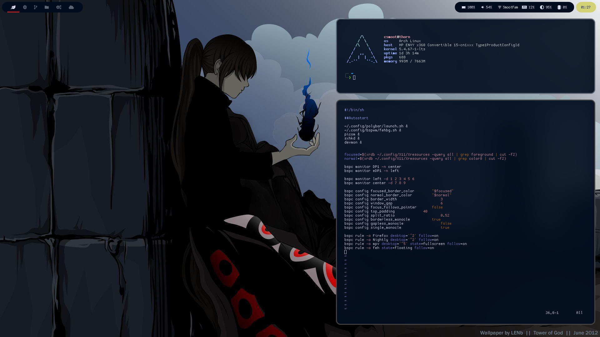

# Dots

Here you can find most configuration files for my Arch environment.

## Project Structure

- [Docs](./Docs/README.md) – This contains my documentation, including the aurs and pacman packages used, and photos for the Readmes.

- [Dots](./dots/README.md) – Configuration, themes, and scripts that are part of my environment.

- [Etc](./etc/README.md) - This contains other files that I use as a base that are not a part of the .config section, including a base iptables config.

## Commands

- `make links` – Create symlinks for all configs. Where possible links
  are created from a directory rather than a file (eg. ~/.config/i3 instead of
  ~/.config/i3/config). **This command will overwrite existing configs**.
- `make install-deps` – Install all dependencies found on
  [pacman.list](./docs/pacman.list) and [aur.list](./docs/aur.list). Works on
  Arch only and assumes pacaur is installed.
- `make vscode-setup` – Install all vscode extensions listed in
  [extensions.list](./dots/.config/Code/extensions.list)
- `make` – All of the above.

## Pics

**Clean**

**Dirty**

